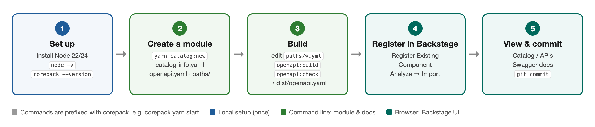

# creed-backstage beginner's guide: publishing an API module from zero

[中文版](GUIDE.zh-CN.md)

> **Who this is for:** anyone new to this project who has not used Backstage or Node.js before.
>
> **What you will be able to do:** run the Creed Developer Portal on your own machine, create a functional module (for example Inventory), write its API documentation, generate `dist/openapi.yaml`, and register and view it in Backstage.
>
> **Time:** 30–45 minutes the first time (mostly installing dependencies); about 5 minutes per module once you know the steps.



---

## 0. A few terms first

| Term | In one sentence |
|---|---|
| **Backstage** | Spotify's open-source developer portal. We use its **Software Catalog** to list our services and **Swagger UI** to show their API documentation. |
| **Module** | A directory under `catalog/` for one functional area, such as `creed-payment` or `creed-order`. Each module holds three entities: a System, a Component and an API. |
| **catalog-info.yaml** | Describes the module's entities (names, owner, tags…). This is the file Backstage reads. |
| **paths/\*.yml** | The API documentation you write by hand. Each file is a complete OpenAPI document. |
| **dist/openapi.yaml** | The single-file API document **generated** by a script; it is what Swagger UI shows. **Never edit it by hand**, but **do commit it**. |
| **corepack** | A tool bundled with Node.js that runs the Yarn version the project pins (4.13.0), so you don't install Yarn yourself. |

---

## 1. Set up your machine (once)

### 1.1 Install Node.js (version 22 or 24)

The project requires Node **22** or **24** (see `engines` in `package.json`). A version manager is recommended so you can switch versions later.

**macOS:**

```bash
# 1) Install nvm (Node Version Manager)
curl -o- https://raw.githubusercontent.com/nvm-sh/nvm/v0.40.3/install.sh | bash
# 2) Close and reopen the terminal, then:
nvm install 22
nvm use 22
```

**Windows:** install [nvm-windows](https://github.com/coreybutler/nvm-windows/releases) (download `nvm-setup.exe`), then in a **new** PowerShell window:

```powershell
nvm install 22
nvm use 22
```

> The 22 LTS installer from <https://nodejs.org> works just as well.
>
> **Do not use Node 25 or later:** Node stopped bundling corepack in version 25.

### 1.2 Check the installation

```bash
node -v             # expect: v22.x.x or v24.x.x
corepack --version  # expect: a version number, e.g. 0.35.0
git --version       # expect: git version 2.x
```

If all three print something, you are ready.

> **Common problem:** `corepack: command not found` → wrong Node version (too old, or 25+). Go back to 1.1 and install 22.

### 1.3 Get the code

```bash
git clone <repository URL> creed-ai-lab
cd creed-ai-lab/creed-backstage
```

> **Every command from here on runs in the `creed-backstage/` directory.**

---

## 2. Install dependencies and start Backstage

### 2.1 Install dependencies

```bash
corepack yarn install
```

- The first time, corepack may ask whether to download Yarn 4.13.0: type **`Y`** and press Enter.
- The first install downloads a lot of packages and takes **5–15 minutes**, depending on your connection. It has succeeded when it ends with `Done` (`Done with warnings` is fine too).
- Behind a corporate proxy, set the `HTTPS_PROXY` environment variable first.

### 2.2 Start

```bash
corepack yarn start
```

This starts two services at once. **Keep this terminal window open:**

| Service | Address |
|---|---|
| Frontend (open this in the browser) | <http://localhost:3003> |
| Backend | <http://localhost:7007> |

A browser tab opens automatically (if not, go to <http://localhost:3003>). Click **ENTER** to sign in as a guest:


> The catalog finishes its first load **about a minute** after the backend starts. Until then the page may be empty; wait and refresh.

After signing in you see the Catalog page with the existing modules (env-matrix, payment, order…):


---

## 3. Create a new module

The example below creates an **Inventory** module. **Open a second terminal window** (the first one is still running `yarn start`) and go to `creed-backstage/`:

```bash
corepack yarn catalog:new creed-inventory \
  --title Inventory \
  --description "Stock levels per warehouse" \
  --server https://localhost:18097 \
  --no-register
```

| Argument | Meaning |
|---|---|
| `creed-inventory` | Module name: lowercase letters and digits joined by `-`. It becomes the System's name; the API is called `creed-inventory-api` |
| `--title` | The name shown in the UI |
| `--description` | A one-line description |
| `--server` | The service's address, **host and port only** (see 4.1 for why) |
| `--no-register` | Don't add the module to `catalog/all.yaml`; you will register it in the UI in section 5. Without this flag it is added automatically and you can skip section 5 |

Expected output:

```text
✎ catalog/creed-inventory/{catalog-info.yaml,openapi.yaml,paths/inventory-health.yml}
✎ catalog/creed-inventory/openapi.yaml — 1 paths from 1 files
✎ catalog/creed-inventory/dist/openapi.yaml written

Next: replace paths/inventory-health.yml with the real endpoints, then
  corepack yarn openapi:build creed-inventory
and commit catalog/creed-inventory/ (dist/ included). Not added to catalog/all.yaml — register it in
Backstage → Create → Register Existing Component with this URL (backend running):
  http://localhost:7007/api/catalog-files/creed-inventory/catalog-info.yaml
```

What it creates:

```text
catalog/creed-inventory/
├── catalog-info.yaml          ← entities: System / Component / API (usually left as is)
├── openapi.yaml               ← entry document: edit info and servers; paths are generated
├── paths/
│   └── inventory-health.yml   ← sample endpoint GET /ping — replace with your real endpoints
└── dist/
    └── openapi.yaml           ← the generated single file (never edit)
```

---

## 4. Write the API documentation and build it

### 4.1 Write endpoints: edit `paths/*.yml`

Each file under `paths/` is a **complete** OpenAPI document. Edit the sample file or add new ones (e.g. `paths/stock.yml`). A minimal example:

```yaml
openapi: 3.1.0
info:
  title: Inventory — stock
  version: 1.0.0
paths:
  /api/inventory/stock/{sku}:          # write the full path
    get:
      tags: [stock]                    # always add a tag: the "Filter by tag" box filters on it
      summary: Stock level of one SKU
      operationId: getStock
      parameters:
        - { name: sku, in: path, required: true, schema: { type: string, example: SKU-001 } }
      responses:
        '200':
          description: Current stock
          content:
            application/json:
              schema:
                $ref: '#/components/schemas/Stock'
        '404': { description: Unknown SKU }
components:
  schemas:
    Stock:
      type: object
      properties:
        sku: { type: string }
        warehouse: { type: string }
        quantity: { type: integer }
```

Three rules:

1. **Write the full path** (`/api/inventory/...`) and keep `--server` to host and port. Spring Boot 3 does not match a trailing `/`: with `/api/inventory` in the server and `/` as the path, the request goes to `/api/inventory/` and returns 404.
2. **Give every operation a `tags` entry.**
3. **Quote values containing a comma inside `{ … }`:** `{ description: 'Unknown id, or gone' }`. Unquoted, YAML treats the text after the comma as another key (the lint in 4.3 catches this).

### 4.2 Build: generate `dist/openapi.yaml`

```bash
corepack yarn openapi:build creed-inventory
```

Expected output (`✎` = file updated, `✓` = unchanged):

```text
✎ catalog/creed-inventory/openapi.yaml — 2 paths from 2 files
✎ catalog/creed-inventory/dist/openapi.yaml written
```

It does two things:

```text
paths/*.yml ──combine──▶ openapi.yaml ──bundle──▶ dist/openapi.yaml
                         (list of $refs)          (single file, read by Swagger)
```

### 4.3 Check: the same validation CI runs

```bash
corepack yarn openapi:check creed-inventory
```

It passes when every line is `✓` and it ends with `Woohoo! Your API description is valid. 🎉`. You can ignore `warning`s; an `error` must be fixed — see section 7 for common ones.

> Without a module name, `openapi:build` / `openapi:check` process **all** modules.

---

## 5. Register the module in Backstage (Register Existing Component)

> Prerequisite: `corepack yarn start` is still running in the first terminal.

**① Open the register page.** Click **Register Existing Component** in the left menu (or **Create** at the top right of the Catalog page → **Register Existing Component**).

**② Enter the URL.** Paste the address printed in section 3 into **URL**:

```text
http://localhost:7007/api/catalog-files/creed-inventory/catalog-info.yaml
```

Then click **ANALYZE**:


**③ Review the entities.** The page lists 4 entities to import: the API `creed-inventory-api`, the Component `creed-resource-inventory`, the System `creed-inventory`, and a `generated-…` entry (the Location for the file itself — this is expected). Click **IMPORT**:


**④ Done.** *The following entities have been added to the catalog* means it worked. Click **VIEW COMPONENT** to see it:


> **Why is the URL `localhost:7007/api/catalog-files/...`?** Backstage can only read files through a URL, not a local disk path. The project's backend publishes the `catalog/` directory read-only at that address, so files you edit locally can be registered directly.

---

## 6. See the result

**System page:** description, owner (creed-platform), tags and the relations graph:


**API documentation:** open the API `creed-inventory-api` → the **Definition** tab, which is Swagger UI. Use **Filter by tag** at the top to narrow the list. The page is read-only — there is no *Try it out*, so nothing calls the real service.


**Catalog list:** the new module appears in the list and can be filtered with **Tags** and the other filters on the left:


### How do I update it after changing the docs?

1. Edit `paths/*.yml`.
2. Run `corepack yarn openapi:build creed-inventory`.
3. Click the refresh icon (↻) on the **About** card of the entity page, or wait for the catalog's automatic refresh (a few minutes).

### Commit

```bash
git add catalog/creed-inventory/
git commit -m "catalog: add creed-inventory module"
```

**Commit `dist/openapi.yaml` too.** On a pull request CI (Bitbucket Pipelines) runs `openapi:check`, and the PR fails if the generated files don't match the sources.

---

## 7. Troubleshooting

| Symptom | Cause / fix |
|---|---|
| `corepack: command not found` | Wrong Node version — install Node 22 (1.1) |
| Page won't open / port in use | Another program holds 3003 or 7007; close it and run `corepack yarn start` again |
| Catalog is empty after signing in | The first load takes about a minute; refresh later |
| `✗ module name '…' must be lowercase words joined by '-'` | Module names may only contain lowercase letters, digits and `-` |
| `✗ catalog/creed-xxx already exists` | The module exists. Pick another name, or delete the directory and run again |
| `✗ … is out of date` | `paths/` changed but was not rebuilt — run `openapi:build` |
| `path … is defined in both …` | Two files in one module define the same path; keep it in one |
| lint `Property 'or …' is not expected here` | Unquoted comma inside `{ … }` — quote the value |
| Analyze fails / file cannot be read | Check that `yarn start` is running and the module name in the URL is right; opening the URL directly in the browser should show the file |
| Import reports the entity already exists (conflict) | The module is already in `catalog/all.yaml` (created without `--no-register`); no need to register it again |
| Definition tab shows old content | Click the ↻ icon on the entity page's About card |
| Swagger shows unresolved `$ref`s | `$text` in `catalog-info.yaml` must point at `./dist/openapi.yaml` |

### Registering in the UI vs. listing in all.yaml

| | Register in the UI (section 5) | List in `catalog/all.yaml` |
|---|---|---|
| How | Register Existing Component | `catalog:new` without `--no-register`, or add a line to `targets` in `all.yaml` by hand |
| Stored in | Backstage's database | the Git repository |
| Who sees it | Only people using the **same** Backstage instance | Every environment that checks out the code or deploys the portal |
| Good for | Trying things locally | **Publishing for real** (recommended) |

> To promote a UI-registered module: first unregister it (entity page, top right **⋮** → **Unregister entity**), then add it to `all.yaml` and commit — otherwise two locations claim the same entities and conflict.

---

## Appendix: command reference

| Command | What it does |
|---|---|
| `corepack yarn install` | Install dependencies (first time, or after `package.json` changes) |
| `corepack yarn start` | Start Backstage (frontend :3003, backend :7007) |
| `corepack yarn catalog:new <module> [options]` | Create a module |
| `corepack yarn openapi:build [modules…]` | Build: generate `openapi.yaml`'s paths and `dist/openapi.yaml` |
| `corepack yarn openapi:check [modules…]` | Check: the same staleness check + lint as CI |
| `corepack yarn openapi:lint [modules…]` | Lint only |

For the design details see `creed-backstage/README.md`.
