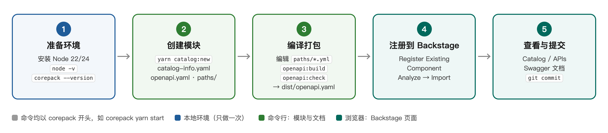
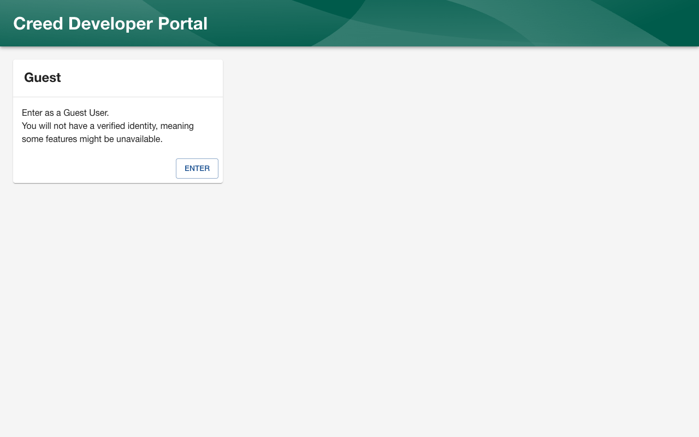
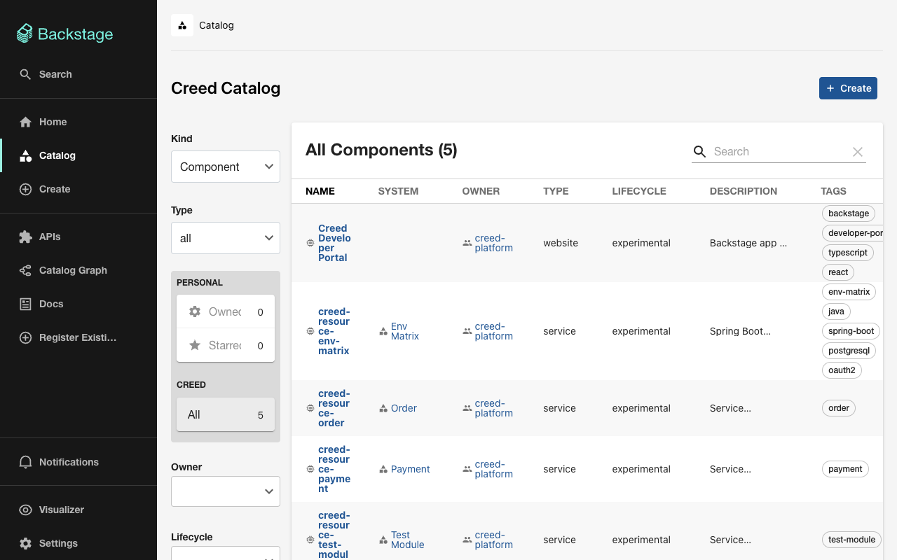
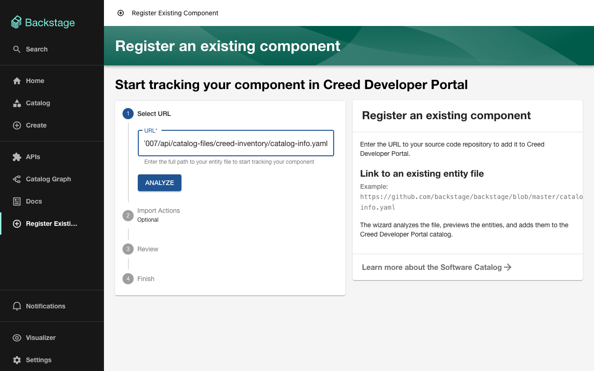
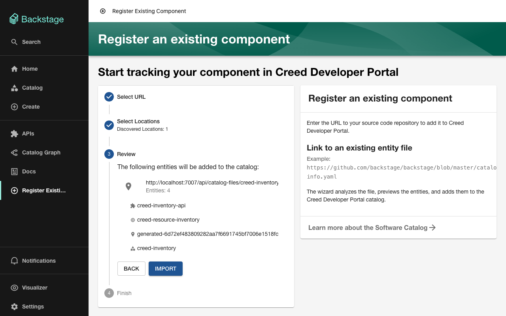
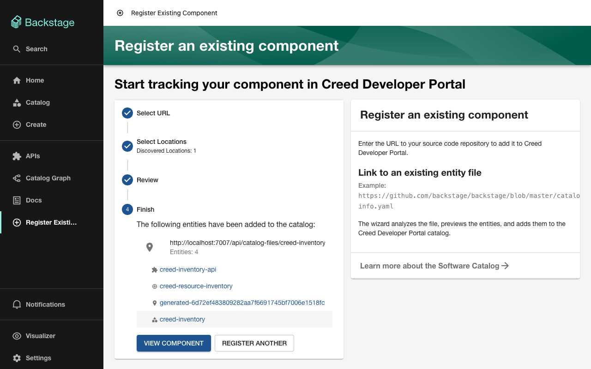
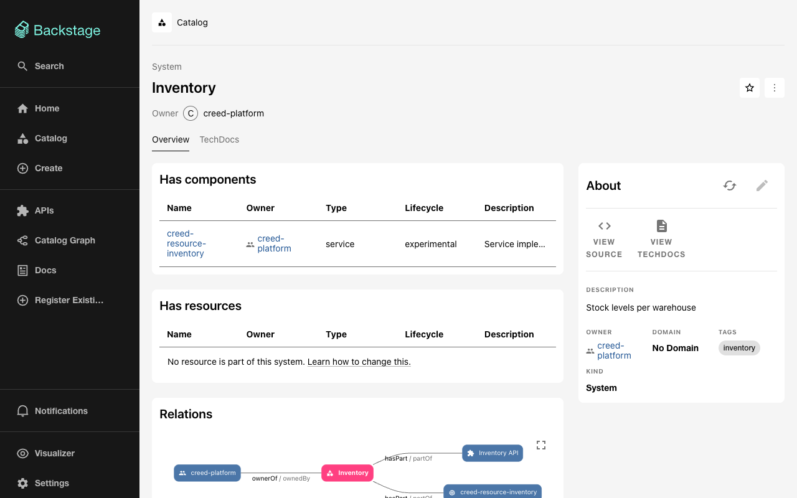
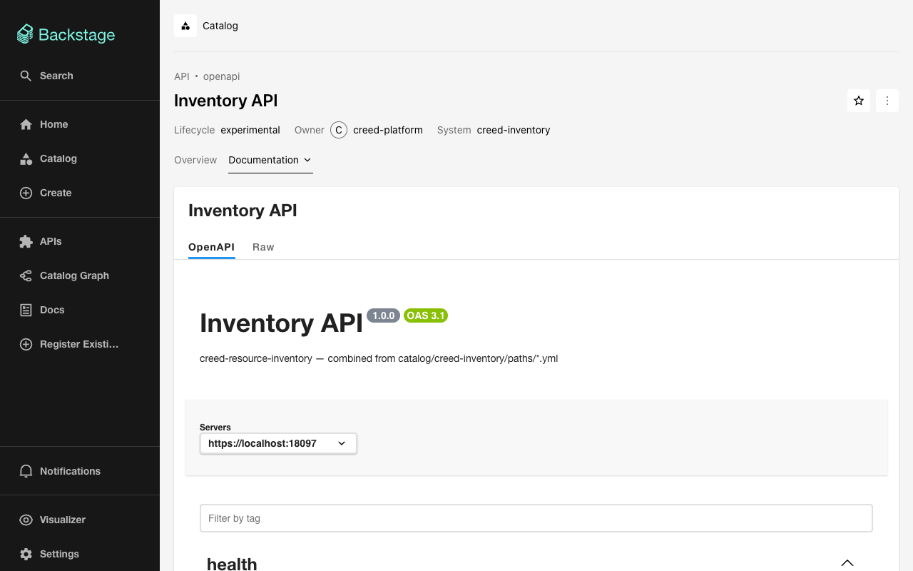
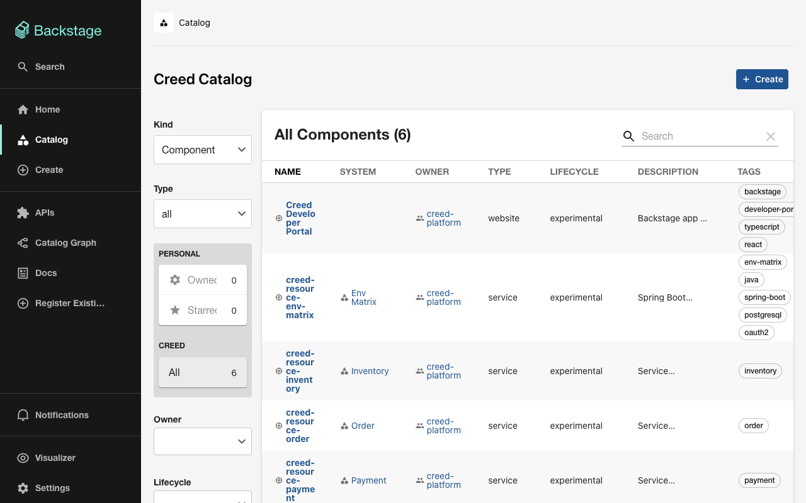

# creed-backstage 新手指南：从 0 到 1 发布一个 API 模块

[English](GUIDE.md)

> **适合谁：** 第一次接触本项目、没有用过 Backstage / Node.js 的同学。
>
> **读完能做到：** 在自己电脑上跑起 Creed 开发者门户，新建一个功能模块（例如 Inventory），写好它的 API 文档，生成 `dist/openapi.yaml`，并在 Backstage 页面上注册、查看它。
>
> **预计用时：** 首次约 30–45 分钟（其中依赖安装占大头）；熟悉之后新建一个模块只需 5 分钟。



---

## 0. 先认识几个名词

| 名词 | 一句话解释 |
|---|---|
| **Backstage** | Spotify 开源的开发者门户。我们用它的 **Software Catalog**（软件目录）登记各个服务，并用 **Swagger UI** 展示 API 文档。 |
| **模块** | `catalog/` 下的一个目录，对应一个功能领域，例如 `creed-payment`、`creed-order`。每个模块包含 System、Component、API 三个实体。 |
| **catalog-info.yaml** | 描述模块中各实体（名字、负责人、标签……）的文件，Backstage 读的就是它。 |
| **paths/\*.yml** | 你手写的 API 文档片段，每个文件都是一份完整的 OpenAPI 文档。 |
| **dist/openapi.yaml** | 由脚本**生成**的单文件 API 文档，Swagger UI 展示的就是它。**不要手改**，但**要提交**到仓库。 |
| **corepack** | Node.js 自带的工具，会自动使用项目指定的 Yarn 版本（4.13.0），你不用另外安装 Yarn。 |

---

## 1. 准备本地环境（只需做一次）

### 1.1 安装 Node.js（22 或 24 版本）

项目要求 Node **22** 或 **24**（见 `package.json` 的 `engines`）。推荐用版本管理工具安装，方便以后切换。

**macOS：**

```bash
# 1) 安装 nvm（Node 版本管理器）
curl -o- https://raw.githubusercontent.com/nvm-sh/nvm/v0.40.3/install.sh | bash
# 2) 关闭并重新打开终端，然后：
nvm install 22
nvm use 22
```

**Windows：** 安装 [nvm-windows](https://github.com/coreybutler/nvm-windows/releases)（下载 `nvm-setup.exe`），然后在**新开的** PowerShell 中：

```powershell
nvm install 22
nvm use 22
```

> 也可以直接从 <https://nodejs.org> 下载 22 LTS 安装包，效果相同。
>
> **不要用 Node 25 及以上**：从 25 起 Node 不再自带 corepack。

### 1.2 检查安装结果

```bash
node -v             # 期望：v22.x.x 或 v24.x.x
corepack --version  # 期望：输出一个版本号，例如 0.35.0
git --version       # 期望：git version 2.x
```

三条命令都有输出，环境就准备好了。

> **常见问题：** `corepack: command not found` → Node 版本不对（太旧或 ≥25），回到 1.1 重新安装 22。

### 1.3 获取代码

```bash
git clone <仓库地址> creed-ai-lab
cd creed-ai-lab/creed-backstage
```

> 本文之后的**所有命令都在 `creed-backstage/` 目录下执行**。

---

## 2. 安装依赖并启动 Backstage

### 2.1 安装依赖

```bash
corepack yarn install
```

- 第一次执行时，corepack 可能询问是否下载 Yarn 4.13.0：输入 **`Y`** 回车。
- 首次安装需要下载大量依赖，约 **5–15 分钟**，看网速。末尾出现 `Done` 即成功（出现 `Done with warnings` 也属正常）。
- 公司网络需要代理时，先设置 `HTTPS_PROXY` 环境变量再执行。

### 2.2 启动

```bash
corepack yarn start
```

这条命令会同时启动两个服务，**不要关闭这个终端窗口**：

| 服务 | 地址 |
|---|---|
| 前端（浏览器访问这个） | <http://localhost:3003> |
| 后端 | <http://localhost:7007> |

浏览器会自动打开（没有的话手动访问 <http://localhost:3003>），点击 **ENTER** 以访客身份登录：



> 后端启动后**约 1 分钟**目录才完成第一次加载，之前页面可能是空的，稍等刷新即可。

登录后看到的 Catalog 页面，列出了已有的模块（env-matrix、payment、order ……）：



---

## 3. 创建一个新模块

下面以新建 **Inventory（库存）** 模块为例。**另开一个终端窗口**（第一个窗口还在运行 `yarn start`），进入 `creed-backstage/`：

```bash
corepack yarn catalog:new creed-inventory \
  --title Inventory \
  --description "Stock levels per warehouse" \
  --server https://localhost:18097 \
  --no-register
```

| 参数 | 含义 |
|---|---|
| `creed-inventory` | 模块名：小写字母、数字，用 `-` 连接。它会成为 System 的名字，API 名为 `creed-inventory-api` |
| `--title` | 页面上显示的名称 |
| `--description` | 一句话描述 |
| `--server` | 服务的地址，**只写到主机和端口**（原因见第 4.1 节） |
| `--no-register` | 不自动加入 `catalog/all.yaml`，稍后在页面上手动注册（第 5 节）。去掉这个参数则自动加入，可跳过第 5 节 |

期望输出：

```text
✎ catalog/creed-inventory/{catalog-info.yaml,openapi.yaml,paths/inventory-health.yml}
✎ catalog/creed-inventory/openapi.yaml — 1 paths from 1 files
✎ catalog/creed-inventory/dist/openapi.yaml written

Next: replace paths/inventory-health.yml with the real endpoints, then
  corepack yarn openapi:build creed-inventory
and commit catalog/creed-inventory/ (dist/ included). Not added to catalog/all.yaml — register it in
Backstage → Create → Register Existing Component with this URL (backend running):
  http://localhost:7007/api/catalog-files/creed-inventory/catalog-info.yaml
```

生成的目录结构：

```text
catalog/creed-inventory/
├── catalog-info.yaml          ← 实体描述：System / Component / API（一般不用改）
├── openapi.yaml               ← 入口文档：info、servers 可以手改；paths 是自动生成的
├── paths/
│   └── inventory-health.yml   ← 示例接口 GET /ping，替换成你的真实接口
└── dist/
    └── openapi.yaml           ← 生成的单文件文档（不要手改）
```

---

## 4. 编写 API 文档并编译打包

### 4.1 编写接口：编辑 `paths/*.yml`

`paths/` 下每个文件都是一份**完整**的 OpenAPI 文档。可以修改示例文件，也可以新建文件（例如 `paths/stock.yml`）。一个最小的例子：

```yaml
openapi: 3.1.0
info:
  title: Inventory — stock
  version: 1.0.0
paths:
  /api/inventory/stock/{sku}:          # 路径写完整
    get:
      tags: [stock]                    # 一定要写 tag：页面上的 "Filter by tag" 靠它过滤
      summary: Stock level of one SKU
      operationId: getStock
      parameters:
        - { name: sku, in: path, required: true, schema: { type: string, example: SKU-001 } }
      responses:
        '200':
          description: Current stock
          content:
            application/json:
              schema:
                $ref: '#/components/schemas/Stock'
        '404': { description: Unknown SKU }
components:
  schemas:
    Stock:
      type: object
      properties:
        sku: { type: string }
        warehouse: { type: string }
        quantity: { type: integer }
```

写的时候注意三点：

1. **路径写完整**（`/api/inventory/...`），`--server` 只写到端口。Spring Boot 3 默认不匹配末尾的 `/`，把 `/api/inventory` 写进 server、路径写 `/`，实际请求会变成 `/api/inventory/`，返回 404。
2. **每个接口写上 `tags`**。
3. **`{ … }` 里的值含逗号时要加引号**：`{ description: 'Unknown id, or gone' }`。不加引号时，YAML 会把逗号后面的部分当成另一个键（第 4.3 节的 lint 能查出来）。

### 4.2 编译：生成 `dist/openapi.yaml`

```bash
corepack yarn openapi:build creed-inventory
```

期望输出（`✎` 表示文件已更新，`✓` 表示无变化）：

```text
✎ catalog/creed-inventory/openapi.yaml — 2 paths from 2 files
✎ catalog/creed-inventory/dist/openapi.yaml written
```

它做了两件事：

```text
paths/*.yml ──combine──▶ openapi.yaml ──bundle──▶ dist/openapi.yaml
                         （引用列表）              （单文件，Swagger 读它）
```

### 4.3 检查：与 CI 相同的校验

```bash
corepack yarn openapi:check creed-inventory
```

全部是 `✓`，并且最后出现 `Woohoo! Your API description is valid. 🎉`，就说明通过。出现 `warning` 可以忽略，出现 `error` 必须修复，常见报错见第 7 节。

> 不写模块名时，`openapi:build` / `openapi:check` 处理**全部**模块。

---

## 5. 在 Backstage 注册模块（Register Existing Component）

> 前提：第一个终端里的 `corepack yarn start` 仍在运行。

**① 打开注册页。** 左侧菜单点 **Register Existing Component**（或 Catalog 页右上角 **Create** → **Register Existing Component**）。

**② 填写 URL。** 在 **URL** 中填入第 3 节命令输出的地址：

```text
http://localhost:7007/api/catalog-files/creed-inventory/catalog-info.yaml
```

然后点击 **ANALYZE**：



**③ 确认实体。** 页面列出将要导入的 4 个实体：API `creed-inventory-api`、Component `creed-resource-inventory`、System `creed-inventory`，以及一条 `generated-…`（代表这个文件本身的 Location，属于正常现象）。点击 **IMPORT**：



**④ 完成。** 看到 *The following entities have been added to the catalog* 即注册成功。点击 **VIEW COMPONENT** 查看：



> **为什么 URL 是 `localhost:7007/api/catalog-files/...`？** Backstage 只能通过 URL 读取文件，不能直接读本地磁盘路径。项目后端把 `catalog/` 目录以只读方式发布在这个地址上，所以本地修改的文件可以直接注册。

---

## 6. 查看效果

**System 页面**：显示描述、负责人（creed-platform）、标签和关系图：



**API 文档**：进入 API `creed-inventory-api` → **Definition** 标签页，就是 Swagger UI。顶部的 **Filter by tag** 可以按 tag 过滤。页面只读，不提供 *Try it out*，不会真正调用服务。



**Catalog 列表**：新模块出现在列表中，可以用左侧的 **Tags** 等条件筛选：



### 修改文档后怎么更新？

1. 编辑 `paths/*.yml`。
2. 执行 `corepack yarn openapi:build creed-inventory`。
3. 在实体页面右上角 **About** 卡片中点击刷新图标（↻），或者等待目录自动刷新（几分钟内）。

### 提交代码

```bash
git add catalog/creed-inventory/
git commit -m "catalog: add creed-inventory module"
```

`dist/openapi.yaml` **必须一起提交**。提交 PR 后，CI（Bitbucket Pipelines）会运行 `openapi:check`，生成文件和源文件对不上时 PR 会失败。

---

## 7. 常见问题

| 现象 | 原因 / 解决 |
|---|---|
| `corepack: command not found` | Node 版本不对，安装 Node 22（第 1.1 节） |
| 页面打不开 / 端口被占用 | 3003 或 7007 被其他程序占用，关闭后重新执行 `corepack yarn start` |
| 登录后 Catalog 是空的 | 后端首次加载约需 1 分钟，稍后刷新 |
| `✗ module name '…' must be lowercase words joined by '-'` | 模块名只能用小写字母、数字和 `-` |
| `✗ catalog/creed-xxx already exists` | 模块已存在。换个名字，或删掉该目录后重新创建 |
| `✗ … is out of date` | 改了 `paths/` 但没重新编译，执行 `openapi:build` |
| `path … is defined in both …` | 同一模块的两个文件写了同一路径，只保留一个 |
| lint 报 `Property 'or …' is not expected here` | `{ … }` 中有未加引号的逗号，给值加引号 |
| Analyze 时报错 / 读不到文件 | 检查 `yarn start` 是否在运行，URL 中的模块名是否拼对；可以先在浏览器里直接打开该 URL 看能否显示内容 |
| Import 时提示实体已存在（conflict） | 该模块已在 `catalog/all.yaml` 中（创建时没加 `--no-register`），无需重复注册 |
| Definition 页还是旧内容 | 点实体页 About 卡片的刷新图标 ↻ |
| Swagger 显示未解析的 `$ref` | `catalog-info.yaml` 中的 `$text` 必须指向 `./dist/openapi.yaml` |

### 页面注册与写进 all.yaml，有什么区别？

| | 页面注册（本文第 5 节） | 写进 `catalog/all.yaml` |
|---|---|---|
| 怎么做 | Register Existing Component | `catalog:new` 时不加 `--no-register`，或手动在 `all.yaml` 的 `targets` 中加一行 |
| 保存在哪里 | Backstage 的数据库中 | Git 仓库中 |
| 别人能看到吗 | 只有连接**同一个** Backstage 的人能看到 | 所有拉取代码、部署门户的环境都能看到 |
| 适合 | 本地试用、临时验证 | **正式发布**（推荐） |

> 想把页面注册的模块转为正式发布：先在实体页面右上角 **⋮** → **Unregister entity** 取消注册，再把它加入 `all.yaml` 并提交，避免两处重复登记导致冲突。

---

## 附录：命令速查

| 命令 | 作用 |
|---|---|
| `corepack yarn install` | 安装依赖（首次、或 `package.json` 变化后） |
| `corepack yarn start` | 启动 Backstage（前端 :3003、后端 :7007） |
| `corepack yarn catalog:new <模块> [选项]` | 新建模块 |
| `corepack yarn openapi:build [模块…]` | 编译：生成 `openapi.yaml` 的 paths 和 `dist/openapi.yaml` |
| `corepack yarn openapi:check [模块…]` | 检查：与 CI 一致的过期检查 + lint |
| `corepack yarn openapi:lint [模块…]` | 只做 lint 校验 |

更详细的设计说明见 `creed-backstage/README.zh-CN.md`。
